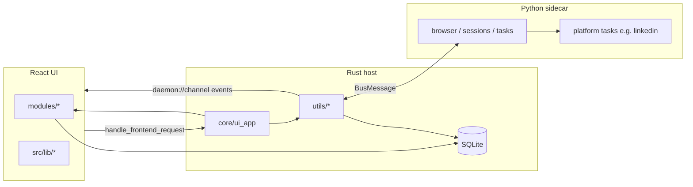

# Project context

Living architecture reference for **tauri_py**: a Tauri desktop app with a React UI, a Rust host, and a Python sidecar for browser automation.

**Keep this file updated.** When you change structure, add a module/task, alter IPC routes, or introduce a new cross-cutting pattern, update the relevant section here in the same PR or commit. Stale docs are worse than none — treat `context.md` as part of the change, not an afterthought.

---

## System overview

Three layers communicate over a single IPC bus (newline-delimited JSON on stdin/stdout between Rust and Python; Tauri `invoke` + events between React and Rust).

| Layer | Role | Runs in |
|-------|------|---------|
| **Frontend** | UI, routing, module registration, task-type metadata | WebView (Vite/React) |
| **Rust host** | DB, orchestration, route registry, sidecar lifecycle, push events to UI | Tauri process |
| **Python sidecar** | Playwright automation, long-running tasks, session cookies | Child process |

**Source of truth:** code and migrations beat this document. Verify against actual files when in doubt.

---

## Request and event flow

### Frontend → Rust (RPC)

1. UI calls `Backend.request(route, payload)` (`src/lib/api.ts`).
2. Tauri invokes `handle_frontend_request` with `{ route, payload }`.
3. `UiApp` dispatches to a handler registered via `BuilderApp::route` (in `src-tauri/src/modules/*.rs` for feature domains, or `src-tauri/src/utils/*.rs` for cross-cutting infra).

### Rust ↔ Python (sidecar bus)

- **Requests:** `Facade::request_with_timeout(route, payload, timeout)` → Python `on_request` handler.
- **Events:** Python `facade.dispatch(event, payload)` → Rust `on_event` handler.
- Messages are `BusMessage` JSON (see `src-tauri/src/sidecar/` and `py-sidecar/runtime/bus_message.py`).

### Rust → Frontend (push)

- `Facade::push_ui(channel, route, payload)` emits Tauri event `daemon://{channel}`.
- UI subscribes with `Backend.subscribeDaemon(channel, cb)`.
- Payload shape: `{ route, payload }` (`DaemonEvent`).

**Naming convention:** dot-separated routes, e.g. `sessions.list`, `runs.start`, `tasks.control`, `task.log`. The first segment is often used as the daemon channel (`session.closed` → `daemon://session`).

---

## Filesystem guide (by concern, not a full tree)

Use this to know *where* code belongs. Do not mirror every file here.

### Frontend (`src/`)

| Zone | Purpose |
|------|---------|
| `src/modules/` | **Feature modules.** Each folder is a self-contained domain (e.g. `sessions`, `linkedin`). Registers routes/menu via `registerModule` in its `index.tsx`. Side-effect import from `src/modules/index.ts`. |
| `src/lib/` | **Shared, domain-agnostic clients and registries.** `api.ts` (Backend), `modular.ts` (UI modules), `tasks.ts` (task types), `runs.ts` / `browser.ts` / `log.ts` (API wrappers). No React pages here. |
| `src/hooks/` | **Reusable React hooks** that compose lib APIs (e.g. `useRuns`). Prefer module-local hooks in `modules/*/hooks.ts` when only one module needs them. |
| `src/components/` | **App shell and design system.** `layout/` (sidebar, runtime drawer), `ui/` (shadcn/Base UI primitives). Not feature business logic. |

### Rust host (`src-tauri/`)

| Zone | Purpose |
|------|---------|
| `src/core/` | IPC plumbing: `BuilderApp` (facade, registry, db, sessions_dir), `Registry`, `Facade`, `UiApp`, request/event handler traits. Rarely touched for features. |
| `src/modules/` | **Feature route modules.** One file or folder per domain (e.g. `sessions.rs`, `runs.rs`). Each exposes a `*_module(&mut BuilderApp)` that registers frontend routes and sidecar event handlers. Listed in `modules::get_modules()` and wired in a loop from `lib.rs`. Add new feature domains here — not in `utils/`. |
| `src/utils/` | **Cross-cutting infra routes** wired in `lib.rs`: `browser`, `log`, `sidecar`. No feature business logic. |
| `src/db/` | SQLite access: `migrate.rs`, `models.rs`, per-table `*.rs` (`sessions`, `runs`). Migrations live in `migrations/YYYYMMDDHHMMSS_name/`. |
| `src/sidecar/` | Spawn and read/write Python child process. |

### Python sidecar (`py-sidecar/`)

| Zone | Purpose |
|------|---------|
| `runtime/` | Daemon entry (`daemon.py`), `BuilderApp`, `Facade`, `Registry`, transport. **Do not put feature logic here.** |
| `modules/__init__.py` | Lists sidecar modules registered at startup (`get_modules()`). |
| `browser/` | Generic Playwright browser/session infrastructure: launch, control, install, `sessions/manager.py`. |
| `tasks/` | **Generic task framework:** registry, `BaseTask`, `TaskManager`, `tasks.start` / `tasks.control` handlers. |
| `{platform}/` | Platform-specific automation (e.g. `linkedin/posts/`). Task implementation + registration only; reuse `browser/` and `tasks/`. |

### Config and tooling (repo root)

| Zone | Purpose |
|------|---------|
| `package.json` / `vite.config.ts` | Frontend build and scripts. |
| `pyproject.toml` | Python deps; `extraPaths` for pyright. |
| `src-tauri/tauri.conf.json` | Tauri app config. |

---

## Modular registration (three parallel registries)

New automation features should register on **all three layers** with the same task key (e.g. `linkedin.posts_scraper`).

### 1. Frontend — UI modules (`src/lib/modular.ts`)

- `registerModule({ id, order, menuFilter?, routes? })` in `src/modules/<name>/index.tsx`.
- Import the module from `src/modules/index.ts` (side-effect only).
- **Menu:** modules can append to existing groups (e.g. `sessions` adds "Sessions" to `sessionable` platform groups) or create new groups (`linkedin` adds "Post Scraper").

### 2. Frontend — task types (`src/lib/tasks.ts`)

- `registerTaskType({ key, platform, label, icon, capabilities, ResultsView?, resultsPath? })`.
- Declares what the RuntimeDrawer shows (pause/stop/restart) and which component renders results.
- Task key must match Python/Rust task identifier.

### 3. Rust — feature modules (`src-tauri/src/modules/`)

- **Sessions** (`modules/sessions.rs`): frontend routes `sessions.*`, sidecar event `session.closed`.
- **Runs** (`modules/runs.rs`): frontend routes `runs.*`, sidecar events `task.*` → persist to DB, push `daemon://runs`.
- New domains: add `modules/<domain>.rs`, export from `modules/mod.rs`, append to `get_modules()`.
- Pattern: typed req structs, DB calls, optional sidecar proxy. Event handlers that use `sqlx` must not hold `.await` across `on_event` futures that require `Sync` — offload DB work to `tokio::spawn` (see `modules/runs.rs`, `modules/sessions.rs`).

### 4. Python — tasks (`py-sidecar/tasks/`)

- `register_task(key, factory)` in the task module (e.g. `linkedin/posts/task.py`).
- Sidecar loads tasks via import in `tasks/module.py`.
- Handlers: `tasks.start`, `tasks.control` only; tasks emit events, they do not define new top-level sidecar routes unless justified.

---

## Data model: runs system

Common tracking for all module tasks (distinct from ephemeral browser instances).

| Table | Holds |
|-------|--------|
| `runs` | One execution: `platform`, `task`, `status`, `params` (run config JSON), `log`, `pause_info`, `error`, counts, timestamps. |
| `run_inputs` | **Input rows** (targets), e.g. profile URLs. `data` JSON + per-input `cursor` checkpoint. |
| `run_items` | **Results**, linked to `input_id`, keyed by `item_key` (e.g. post id). |

**Terminology**

- **Params** — run-level configuration (session id, headless, limits, matcher).
- **Input rows** — many targets for one run; results correlate via `input_id`.
- **Pause** — cooperative; checkpoint in `cursor` / `pause_info`; resume skips items already in `run_items`.

On app startup, `running` / `stopping` runs are marked `shutdown` (resumable from checkpoint).

---

## Coding rules (modular, decoupled, clean)

### Boundaries

1. **No cross-module deep imports.** Modules import from `@/lib/*`, `@/components/ui/*`, and their own subtree. Do not import `src/modules/foo/components/Bar` from `modules/baz` — extract shared pieces to `lib/` or `components/`.
2. **Frontend never talks to Python directly.** All I/O goes through `Backend.request` or `subscribeDaemon`.
3. **Python tasks never touch SQLite.** Persistence is Rust’s job via sidecar events.
4. **Rust modules do not embed Playwright logic.** Proxy to Python or read/write DB only. Feature routes belong in `modules/`, not `utils/`.
5. **Keep `core/` and `runtime/` thin.** Register handlers in `modules/` or `utils/`; don’t grow god-files.

### Adding a feature (checklist)

1. **DB** — migration in `src-tauri/migrations/`, models + CRUD in `src/db/`, register in `migrate.rs` and `db/mod.rs`.
2. **Rust** — routes/events in `src/modules/<domain>.rs`, register in `modules/mod.rs` via `get_modules()`.
3. **Python** — task or handler under `py-sidecar/<platform>/` or `browser/`, register in `tasks/registry` or `modules/__init__.py`.
4. **Frontend** — `src/modules/<name>/` with `index.tsx` registration; API wrapper in module `api.ts` or `src/lib/` if shared; hooks with `useState`/`useEffect` (no react-query unless project standard changes).
5. **Task type** — `registerTaskType` if it’s a `runs`-tracked task.
6. **Update `context.md`** — see below.

### Route and API conventions

- Rust frontend routes: `{domain}.{verb}` (`sessions.list`, `runs.start`).
- Python sidecar requests: `{domain}.{verb}` (`session.launch`, `tasks.start`).
- Task lifecycle events: `task.{noun}` (`task.log`, `task.status`).
- Daemon channel: usually first segment of pushed route (`runs`, `browser`, `session`, `log`).
- Payloads: JSON objects; use `snake_case` keys to match Rust/Python.

### Rust-specific

- Event handlers that use `sqlx` must not hold `.await` across `on_event` futures that require `Sync` — offload DB work to `tokio::spawn` (see `modules/runs.rs`, `modules/sessions.rs`).
- Prefer typed request structs with `Deserialize` on `app.route` handlers.
- Re-export public DB types from `db/mod.rs`; keep queries in table modules.

### Python-specific

- Async handlers for I/O; use `RunControl` for pause/resume/stop in long loops.
- Emit progress via `TaskContext` methods (`ctx.log`, `ctx.item`, `ctx.status`, …), not ad-hoc bus calls from deep helpers when a context is available.
- Session cookies: `browser/sessions/storage.py` (`storage_state.json` per session dir).

### Frontend-specific

- **MUI/Grid:** N/A; project uses shadcn/Base UI + Tailwind.
- **Grid (if added):** MUI v7 — use `component="div"`, `size` prop, not legacy `item`/`xs` props.
- Module `index.tsx`: registration + re-exports only; pages live under `components/`.
- Prefer `RunsApi` / domain APIs over raw `Backend.request` in components.

### What not to do

- Do not add feature routes to `core/mod.rs` or `handler.rs` — use `modules/*_module`.
- Do not store scraped results only in memory; use `run_items` for resumable tasks.
- Do not duplicate registration (one task key, one factory, one `registerTaskType`).
- Do not edit generated or vendor paths (`dist/`, `node_modules/`, `.venv/`).
- Do not expand scope in unrelated files when fixing a bug.

---

## Key runtime surfaces

| Surface | Location |
|---------|----------|
| Runtime drawer (task tabs, per-run log, controls) | `src/components/layout/RuntimeDrawer.tsx` |
| Module menu / routes aggregation | `src/lib/modular.ts`, `src/components/layout/AppSidebar.tsx` |
| App setup (DB, sidecar, module wiring) | `src-tauri/src/lib.rs` |
| Python daemon entry | `py-sidecar/runtime/daemon.py` |
| Session persistence dir | configured in `Config::init`, stored on `BuilderApp.sessions_dir` |

---

## Maintaining this document

Update `context.md` when you:

- Add or remove a **top-level zone** (`src/modules/*`, `src-tauri/src/modules/*`, `py-sidecar/*`, `src-tauri/src/utils/*`).
- Add a **migration** or change runs/sessions schema semantics.
- Introduce a **new registration pattern** or IPC route family.
- Change **pause/resume** or startup-reset behaviour.
- Add a **new task type** (document its key and which layer registers it).

**How to update**

1. Edit the relevant section; avoid duplicating file trees — describe *roles* and *patterns*.
2. If a section is wrong, fix it and add a one-line note with date if the behaviour changed intentionally.
3. Remove obsolete sections rather than leaving strikethrough archaeology.
4. In PR descriptions, mention “context.md updated” when applicable.

**Review trigger:** any PR that adds a module, task, or `modules/*_module` should include a `context.md` diff or an explicit note why docs were unchanged.

---

*Last aligned with codebase: 2026-06-19 (Rust feature modules in `src-tauri/src/modules/`, runs/task system, LinkedIn posts scraper, RuntimeDrawer tabs).*
